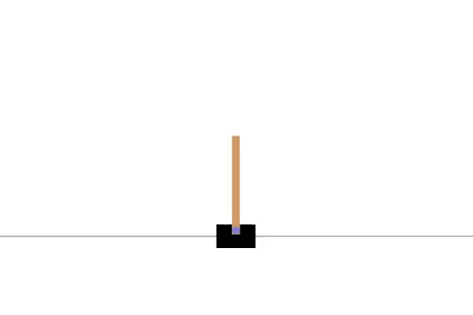
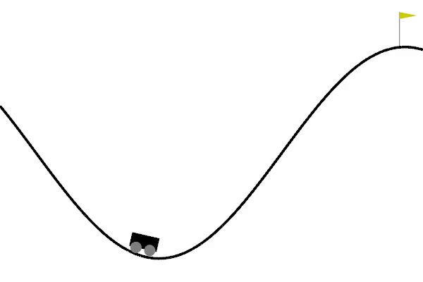
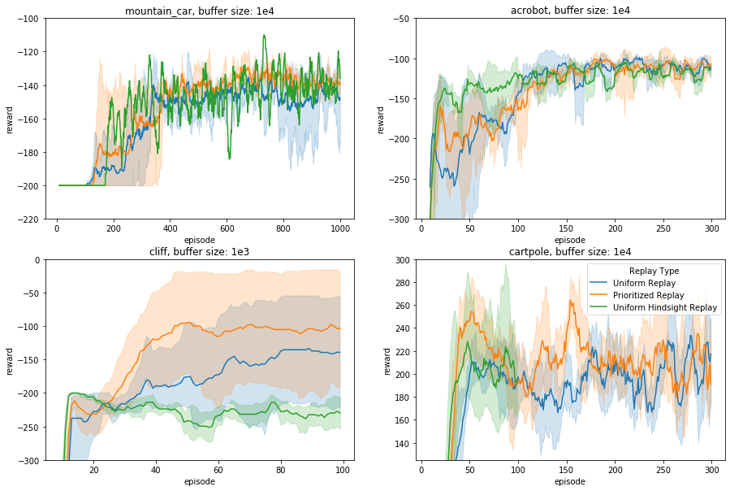
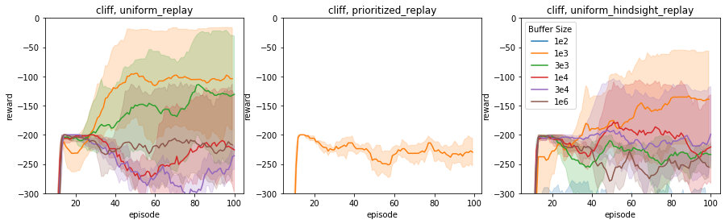

# How to learn from experience?
In this blogpost we investigate the effect of 3 different forms of experience replay on 4 different environments. As an additional experiment, we also investigate the effect of setting the hyperparameter of these methods to different values. 

## Deep Q Networks and Experience Replay?

Q-learning has shown its usefulness on a lot of different tasks, but how does this method scale to more complex issues, like real-world problems? The number of states and actions can grow exponentially, which makes it infeasible to store Q values for all possible combinations.  
The RL community has found a solution to this in Deep Q Networks (DQN), where Q-learning is infused with Deep Learning. This is a ‘simple’ idea were we replace the Q Learning’s table with a neural network that tries to approximate Q Values instead. 
One problem that we face during training DQN's however, is that in RL, the agent learns from experiences. It uses each experience or sample transition, e.g. (state, action, reward, new state), that it has to update its internal beliefs. However, this means that the sequential data we sample from our agent will be temporal. So when we feed it to our network, the sequential nature of the data will cause it to have a strong temporal correlation. Neural networks (NNs) were not made with this kind of data in mind. There are two main reasons for this:

1. NN's are based on Stochastic Gradient Descent methods which are based on the assumption that the data is i.i.d, identically and independently distributed. Since each experience is based on previous experiences, this assumption does not hold.
2. DQN’s like most NN’s suffer from the problem that they tend to forget data it has seen in the past. In standard RL algorithms, this wouldn’t be a problem as experiences are discarded as soon as they are used. However, in the case of NN’s it is beneficial to train on the same experiences multiple times at different stages of training, especially since convergence of the Q-values can be slow. The temporal nature of our data will however cause the DQN to be biased to forgetting its early experiences. We don’t simply want the agent to forget what it has seen further in the past.

These problems can both have a negative impact on the stability of the training process. Luckily, a solution to both problems is found in experience replay. The idea is simple, we only have to store the agent’s experiences in a memory buffer. This way, we can sample from this buffer during training which both breaks the temporal correlation between data samples, and at the same time allows the model to re-train on previous experiences.


Storing previous experiences and training on them multiple times also has an additional benefit as we can now optimally exploit every single sampled transition we have by controlling how and how often it is "remembered". This means that we can learn more with the same amount of samples i.e. it is more sample efficient. This is especially beneficial in cases where gaining real-world experience is expensive. Thus, experience replay stabilizes the training process and increases the sample efficiency.

## Different Types of Experience Replay and Environments
Now that we have understood why it is important to maintain a memory buffer, we can think of what is the most optimal way to do this. Various experience replay methods have been developed and they mostly differ in two main aspects. Firstly, which experiences do we store in the memory buffer? And secondly, how do we efficiently sample from this memory buffer? How each method handles these questions will influence different types of environments differently and thus each method is typically developed to handle different types of problems. In this blogpost we will look at three different ways to employ experience replay.

### Uniform Experience Replay (ER)

Each experience is stored into the buffer and when we reach capacity, we discard our oldest memories. Thus, we keep our most recent memories in the buffer. For sampling, we simply take a random batch of experiences. Each sample has the same probability of being chosen so sample behaviour that is seen more often will therefore also be repeated more and more often.

### Prioritized Experience Replay (PER)
This method is developed to really exploit samples that display rare or surprising behaviour. The key intuition behind this is that the model can learn more from certain samples than from others, and thus we shouldn’t blindly repeat each of them with equal frequency. Instead, we should prioritize replaying certain samples over others. 
*So how do we determine which samples should be prioritized?* Ideally, we would like to know how much the agent can learn from a transition in its current state, but this knowledge is not accessible to us. Luckily, we can approximate this with another metric. Since we are trying to minimize the magnitude of the TD error as an objective function, we can use the absolute TD error $|\delta_i|$ as a proxy of how much priority a sample i should get.  Where: 
$$\delta_{i} = r_{t} + \lambda max_{a \in A} Q_{\theta}(s_{t+1}, a) - Q_{\theta}(s_{t}, a_{t})$$
Now, to store this information during training, we can simply extend the sample transitions we want to store in our memory buffer with this priority proxy: *(state, action, reward, new state, $|\delta_i|$)*. When the memory buffer reaches its capacity limit, we simply remove the oldest samples. 
So now we know which samples to store and how to store them, but we still need to find a way to actually use them as intended. This leads us to the second aspect: *How do we sample from the memory buffer?* We will have to construct a probability distribution where the samples with higher priorities are more likely to be picked for repetition. To get the right priorities for each sample we use the absolute TD error plus some value $\epsilon$ to ensure that each sample in the buffer will be picked with a non-zero probability. We then simply construct a probability distribution as follows:
$$P(i) = \frac{|\delta_{i}|^{\alpha}}{\sum_k |\delta_{i}|^{\alpha}}$$
Now to pick the more useful samples with a higher priority, we just have to sample from this distribution!


### Hindsight Experience Replay (HER)
Introduced by Openai in [this paper](http://papers.nips.cc/paper/7090-hindsight-experience-replay.pdf), this type of experience replay allows our agent to learn from failed experiences. The intuition behind this is that, even when the agent fails, this doesn’t make the experience completely invaluable, the behavior could still be useful in another context. So we don’t just want to dismiss these experiences altogether! HER solves this problem by adapting the sampled transitions that it stores in memory such that it treats failed experiences as successes given the context in which it is used. 

HER can also be effectively used in multi-goal settings. As the agent can ‘hallucinate’ reaching multiple goals at the end of an episode, making it so that the agent can maximally learn from this episode. *TODO*: Formally this changes the transitions structure like this:

### Environments
As mentioned earlier, these different forms of experience replay will have a different impact on different types of environments. In this blogpost we will focus on three types of deterministic environments with different characteristics:

1. A simple environment/task: [CliffGridworld-v0](https://github.com/podondra/gym-gridworlds)
2. A relatively complex environment/task: [Acrobot-v1](https://gym.openai.com/envs/Acrobot-v1/) and [CartPole-v1](https://gym.openai.com/envs/CartPole-v1/)
3. An environment with binary and sparse rewards: [MountainCarContinuous-v0](https://gym.openai.com/envs/MountainCarContinuous-v0/)


## What will we investigate?
We will investigate the behaviour of the introduced experience replay methods on the environments we just proposed. As you have hopefully understood by now, this is interesting as the method of experience replay and the type of task it is used on, may heavily influence the performance of the model. For this we form the following hypothesis: we expect PER to perform better on the more complex environment and HER to perform better on the environment with binary and sparse rewards. For the simple environment we think that ER will be sufficient and that using PER or HER might not provide a competitive advantage.

Also, if you recall, we explained earlier that experience replay should have a positive influence on the training stability and the sample efficiency. Thus, we will compare the influence of each method on each environment w.r.t. the number of training steps, samples needed for convergence, and the cumulative reward.

Apart from this, according to this [paper by Zhang & Sutton](https://arxiv.org/pdf/1712.01275.pdf), there is another important component to experience replay which effect has been underestimated: the memory buffer size! They show that for different environments, different buffer sizes are optimal. For example, uniform experience replay does not stimulate the algorithm much to use recent transitions, except by throwing out the oldest experiences when the maximum capacity is reached. However, when the buffer size is set to e.g. $10^6$ then the probability of using recent transitions, once the buffer is reaching maximum capacity, is very small. If too little recent experiences are used, this can negatively effect the performance in which case we would say that the buffer size is too large. Contrary, you could not use enough older experiences i.e. set your buffer size too small as well. 

Whether buffer sizes are too large or too small depends on your environment. Thus, we perform an additional experiment, where we will run each form of experience replay on each environment with 3 different values for the buffer size capacity: 3000 (small), 10.000 (medium), 30.000 (large). From these we will use the results from the most optimal buffer size for investigation. 

Since the randomness in the architecture can affect the results, we run the model 5 times with different random seeds and report the average and variance over these results.

## Implementation Details
### Deep Q-Network
We use a simple DQN that is trained with the Adam optimizer. 

```python
class QNetwork(nn.Module):
    
    def __init__(self, input_dim, num_hidden=512, output_dim):
        nn.Module.__init__(self)
        self.l1 = nn.Linear(input_dim, num_hidden)
        self.l2 = nn.Linear(num_hidden, output_dim)

    def forward(self, x):
        relu_output = F.relu(self.l1(x))
        out = self.l2(relu_output)
        return out
```

For the learning rate $\alpha$ and discount factor $\gamma$ we first perform a grid search over $\alpha=[0.0001, 0.0005, 0.001]$ and $\gamma=[0.7, 0.75, 0.8, 0.99]$ for each environment. Since the tasks we train on are very different, we can not just use the hyperparameter values that perform well on one environment and expect it to generalize well to the others. For the first three games it is sufficient to train the agent for 300 episodes, but through experimentation we found that MountainCar needs 1000 episodes to converge. 

|              | $\alpha$   | $\gamma$   |
|--------------|------------|------------|
| Cliffworld   |  0.0001   	|    0.8   	 |
| Acrobot      |  0.001    	|    0.99    |
| Cartpole     |  0.001    	|    0.8     |
| Mountain Car |  0.001    	|    0.99    |

Thus, we use the same model with different hyperparameter values for each environment, but the model remains constant for each of the ER methods. Since we are interested in the effect of the ER methods in each environment, this is a fair comparison. 

### Prioritized Experience Replay 
The implementation of PER is based on the code from [this](https://github.com/rlcode/per/blob/master/prioritized_memory.py) GitHub. The hyperparameter $\alpha$ controls the level of prioritization that is applied, when $\alpha \rightarrow 0$ there is no prioritization, whereas, when $\alpha \rightarrow 1$ there is full prioritization. We don't want to apply full prioritization as it would cause our model to overfit. Therefore, we assign $\alpha$ a value of 0.6 which was found in the [original PER paper](https://arxiv.org/pdf/1511.05952.pdf) by using a coarse grid-search.


```python
class PrioritizedER():

    def __init__(self, capacity, n_episodes, alpha=0.6, beta=0.4):
        self.alpha = alpha
        self.beta = beta
        self.capacity = capacity
        self.beta_increment_per_sampling = 0.001
        self.e = 10e-2
        self.tree = SumTree(capacity)

    def push(self, transition, error):
        delta = (abs(error) + self.e) ** self.alpha
        self.tree.add(delta, transition)

    def sample(self, batch_size):
        batch = []
        idxs = []
        segment = self.tree.total() / batch_size
        priorities = []

        for i in range(batch_size):
            a = segment * i
            b = segment * (i + 1)

            s = random.uniform(a, b)
            (idx, p, data) = self.tree.get(s)
            priorities.append(p)
            batch.append(data)
            idxs.append(idx)

        sampling_probabilities = priorities / self.tree.total() + 10e-5
        is_weight = np.power(self.tree.n_entries * sampling_probabilities, -self.beta)
        is_weight /= is_weight.max()
        return batch, idxs, is_weight
```

Furthermore, it would be costly to store the transitions in a list, as we would have to traverse the whole list and compare all the $|\delta_i|$ values. As a solution, the paper proposes a sum-tree data structure to store the transitions, as a result we now achieve a complexity of $O\log N$ when updating and sampling. We used [this](https://github.com/rlcode/per/blob/master/SumTree.py) code to implement the sum-tree.

### Hindsight Experience Replay
The implementation of Hindsight Experience Replay is based on [this](https://github.com/orrivlin/Hindsight-Experience-Replay---Bit-Flipping) and [this](https://github.com/openai/baselines/tree/master/baselines/her) implementation. 

Since we are dealing with environments that have only one goal, our implementation is quite simple, as we do not have to change the goal in any non-terminal states, instead we only change the achieved value in the end state of an episode. 

**HER code snippet?**
One parameter called ‘replay k’ is introduced which sets the ratio of HER replays versus normal replays in the buffer. We set ‘replay k’ to 4 as that is what is also used by OpenAI in their experiments, especially since we are only changing the value of only the last state of an episode.

## Results
First we'll look at the performance of each replay type for every environment. We'll use the buffer size that performed best on each environment.

In the acrobot environment, all replay types reach around the same reward, although PER gets there the quickest. Interestingly in the cliff env, ER outperforms HER and PER significantly.

It is important to show not only returns but demonstrations of the learned policy in action. Without understanding what the evaluation returns indicate, it is possible that misleading results can be reported which in reality only optimize local optima rather than reaching the desired behaviour.



## Conclusion

TODO: we saw that this type of ER is better on this env blabla


Furthermore, we saw that a too small or too big buffer size has indeed a negative impact on the perfomance. Even so much so that in these environments the buffer size seemed to matter more than the type of ER method that is used. Thus, when using DQN's it is important to also spend some time on optimizing the buffer size you use! Since we observed that during different stages of training different buffer sizes seemed optimal, it would be interesting to see whether dynamically changing the buffer size could be beneficial. In addition, the [paper by Zhang & Sutton](https://arxiv.org/pdf/1712.01275.pdf) also proposes a solution to diminish the negative impact of a suboptimally chosen buffer size. This solution is called combined experience replay (CER), an extension to uniform experience replay. Unfortunately, applying this method was outside the scope of this project, but it would also be interesting for further research. 


